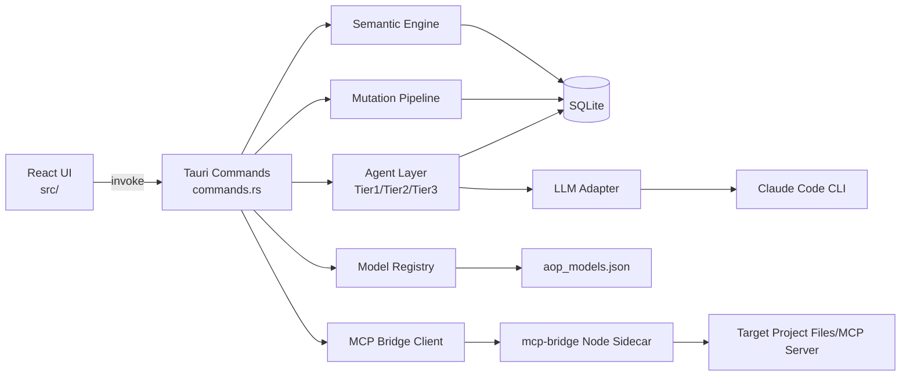
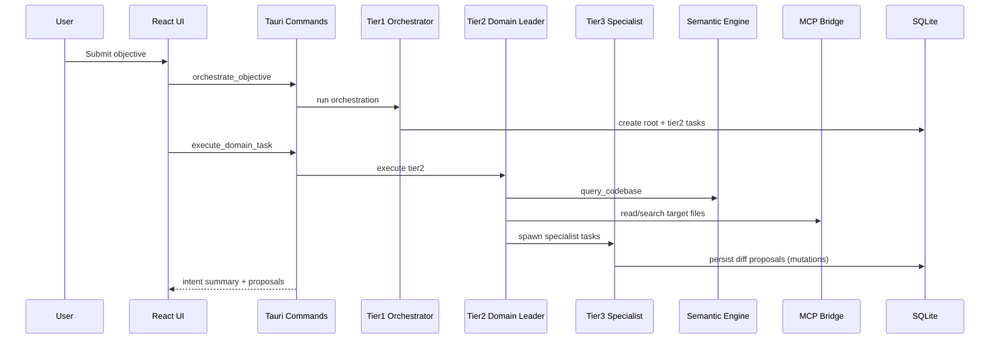
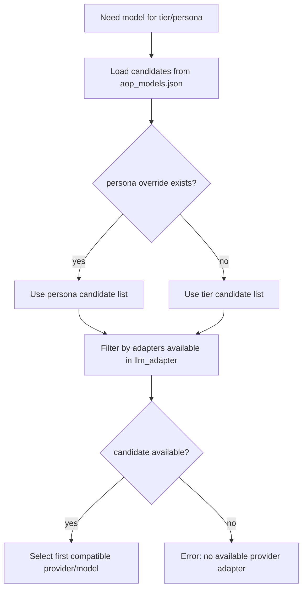
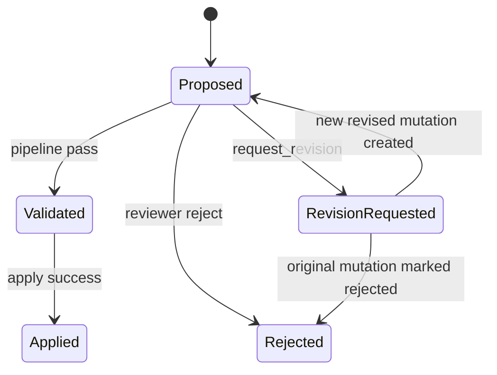

# AOP Diagrams

## 1) Component Architecture

```mermaid
flowchart LR
  UI[React UI<br/>src/] -->|invoke| CMD[Tauri Commands<br/>commands.rs]
  CMD --> AGENTS[Agent Layer<br/>Tier1/Tier2/Tier3]
  CMD --> PIPE[Mutation Pipeline]
  CMD --> VECTOR[Semantic Engine]
  CMD --> BRIDGE[MCP Bridge Client]
  CMD --> MODELS[Model Registry]

  AGENTS --> DB[(SQLite)]
  PIPE --> DB
  VECTOR --> DB

  BRIDGE --> NODE[mcp-bridge Node Sidecar]
  NODE --> TARGET[Target Project Files/MCP Server]

  MODELS --> CONF[aop_models.json]
  AGENTS --> ADAPTER[LLM Adapter]
  ADAPTER --> CLAUDE[Claude Code CLI]
```

## 2) Objective to Diff Proposal

```mermaid
sequenceDiagram
  participant U as User
  participant UI as React UI
  participant C as Tauri Commands
  participant T1 as Tier1 Orchestrator
  participant T2 as Tier2 Domain Leader
  participant T3 as Tier3 Specialist
  participant V as Semantic Engine
  participant B as MCP Bridge
  participant D as SQLite

  U->>UI: Submit objective
  UI->>C: orchestrate_objective
  C->>T1: run orchestration
  T1->>D: create root + tier2 tasks
  UI->>C: execute_domain_task
  C->>T2: execute tier2
  T2->>V: query_codebase
  T2->>B: read/search target files
  T2->>T3: spawn specialist tasks
  T3->>D: persist diff proposals (mutations)
  C-->>UI: intent summary + proposals
```

## 3) Model Resolution (Multi-Provider)

```mermaid
flowchart TD
  A[Need model for tier/persona] --> B[Load candidates from aop_models.json]
  B --> C{persona override exists?}
  C -- yes --> D[Use persona candidate list]
  C -- no --> E[Use tier candidate list]
  D --> F[Filter by adapters available in llm_adapter]
  E --> F
  F --> G{candidate available?}
  G -- yes --> H[Select first compatible provider/model]
  G -- no --> I[Error: no available provider adapter]
```

## 4) Proposal Review and Revision

```mermaid
stateDiagram-v2
  [*] --> Proposed
  Proposed --> Validated: pipeline pass
  Proposed --> Rejected: reviewer reject
  Proposed --> RevisionRequested: request_revision
  RevisionRequested --> Rejected: original mutation marked rejected
  RevisionRequested --> Proposed: new revised mutation created
  Validated --> Applied: apply success
```
